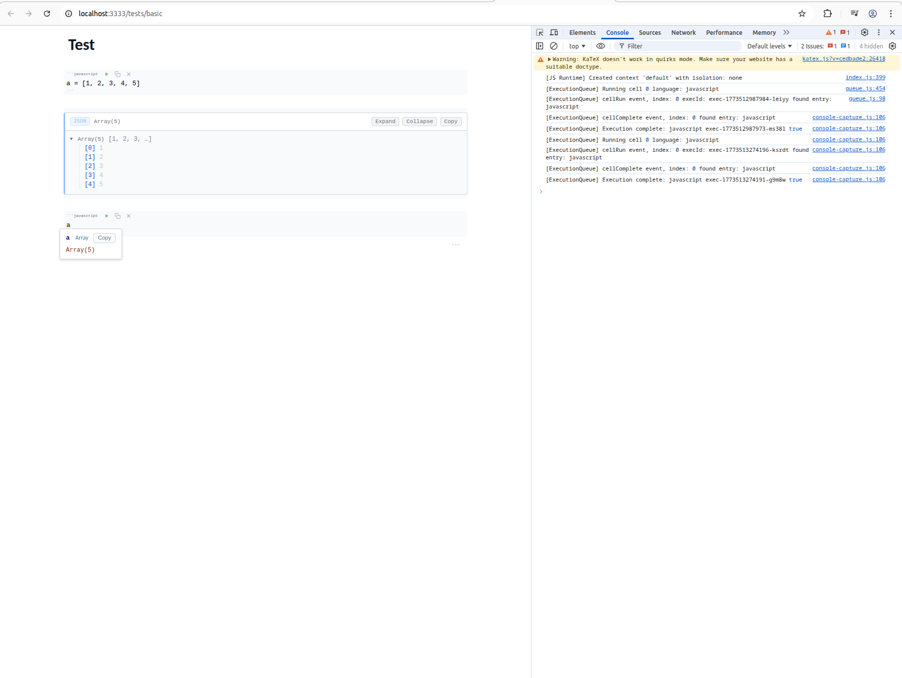

# Learn mrmd-editor: From Zero to Mastery

An interactive notebook for learning mrmd-editor step by step.
Best experienced with a **running** editor — follow along in your browser console.

---

## Setup

### Prerequisites

- **Node.js 22+** (Vite requires 20.19+ or 22.12+)

If you use nvm:

```bash
nvm use 22
```

### 1. Install & Build

```bash
cd mrmd-editor
npm install
npm run build        # bundles src/ + dependencies → dist/mrmd.iife.js
```

### 2. Serve Locally (two options)

**Option A: Vite (recommended for development)**

```bash
npx vite             # instant dev server with hot reloading
```

Vite serves source files directly — no bundling step. Change a file in `src/`,
the browser updates in under a second. This is the fastest feedback loop.

**Option B: Static server (uses pre-built bundle)**

```bash
npx serve . -p 3333
```

This serves the pre-built `dist/mrmd.iife.js`. You need to run `npm run build`
(or `npm run dev` for watch mode) whenever you change source files.

Both options serve the same HTML files — a Vite plugin rewrites script tags
on-the-fly so existing `<script src="../dist/mrmd.iife.js">` tags work in both modes.

Open **http://localhost:3333/tests/basic.html** in your browser.

### Why is a build step needed?

The browser loads **one file**: `dist/mrmd.iife.js`. But the source code is split across
many files in `src/`, plus dozens of dependencies in `node_modules/` (CodeMirror, Yjs,
KaTeX, etc.). **Rollup** bundles all of them into a single file the browser can use.

Think of it like R's `library()` — except browsers can't resolve packages at runtime,
so you pre-bundle everything.

The build outputs 4 formats:

| File | Format | Use |
|------|--------|-----|
| `dist/mrmd.iife.js` | IIFE | `<script>` tags in HTML |
| `dist/mrmd.iife.min.js` | IIFE minified | Production |
| `dist/mrmd.cjs` | CommonJS | Node.js `require()` |
| `dist/mrmd.esm.js` | ES Module | Modern `import` |

### Bundlers: Development vs Distribution

mrmd uses **two different tools** for two different jobs:

| | Development | Distribution |
|---|---|---|
| **Tool** | Vite | Rollup |
| **Speed** | Instant (<1s) | Slow (~28s) |
| **How** | Serves source files directly, no bundling | Bundles everything into one file |
| **When** | Every time you edit code | Once, when you publish |
| **Command** | `npx vite` | `npm run build` |

**Why two tools?** Rollup produces the cleanest output for libraries — excellent
tree-shaking and clean IIFE/CJS/ESM bundles. But it's slow because it's written
in JavaScript, parsing JavaScript. Vite skips bundling entirely during development —
the browser supports `import` natively, so Vite just serves each file individually.

Other bundlers in the ecosystem:

| Bundler | Speed | Written in | Notes |
|---------|-------|-----------|-------|
| **Rollup** | ~28s | JavaScript | Clean output, great for libraries |
| **Webpack** | ~30-60s | JavaScript | Older, more complex |
| **esbuild** | ~1-2s | Go | 10-100x faster than Rollup |
| **Vite** (dev) | instant | JS + esbuild | Doesn't bundle at all in dev mode |
| **Turbopack** | ~1-3s | Rust | Next.js team, very new |
| **SWC** | ~1-2s | Rust | Usually a transformer inside other tools |

---

## Chapter 1: The Minimal Editor

The simplest possible mrmd editor:

```html
<html>
<head>
  <title>Minimal mrmd</title>
  <style>
    * { margin: 0; padding: 0; box-sizing: border-box; }
    body { height: 100vh; display: flex; flex-direction: column; }
    #editor { flex: 1; overflow: auto; max-width: 800px; margin: 0 auto; width: 100%; padding: 20px 0; }
  </style>
</head>
<body>
  <div id="editor"></div>
<script src="https://unpkg.com/mrmd-editor/dist/mrmd.iife.min.js"></script>
  <script>
    const editor = mrmd.create('#editor', {
      javascriptIsolation: 'none'
    });
    window.editor = editor;
  </script>
</body>
</html>

```



Three things happen:
1. `mrmd.create('#editor', ...)` creates a full-viewport editor inside the `<div>`
2. `javascriptIsolation: 'none'` lets code cells access page globals (like `editor`)
3. `window.editor = editor` exposes it to the browser console (F12)

### JavaScript Isolation Modes

By default, JS code cells run in an **iframe sandbox** — they can't see `window.editor`
or anything else on the page. This is safe but limiting.

| Mode | How | Cells can access page? | Use case |
|------|-----|----------------------|----------|
| `'iframe'` (default) | Hidden iframe | ❌ No | Untrusted code, production |
| `'none'` | Main window | ✅ Yes | Learning, debugging, trusted code |

With `'none'`, you can write code cells that inspect and control the editor itself —
**learning mrmd from inside mrmd**:

````markdown
```javascript
// This works because isolation is 'none'
editor.getContent()
```

```javascript
editor.setTheme('midnight')
```

```javascript
editor.getCells().length
```
````

This is the setup we'll use throughout this notebook. You can paste any example
into a code cell and run it with **Shift+Enter**.

---

## Chapter 2: Reading & Writing Content

Open the browser console (F12) and try these one at a time:

### Get current content

```js
editor.getContent().toString().replaceAll('`', '')
// → "" (empty editor)
```

### Set content (replaces everything)

```js
editor.setContent("# Hello World\n\nThis is **bold** and *italic*.")
```

### Insert at a specific position

```js
editor.insert(0, "INSERTED → ")
// Adds text at the very beginning (position 0)
```

### Insert at cursor

```js
editor.insertAtCursor("\n\nNew text at cursor position!")
```

### Replace a range

```js
editor.replace(0, 5, "REPLACED")
// Replaces characters 0-5 with new text
```

### Read it back

```js
editor.getContent().toString().replaceAll('`', '')
// Returns the full document as a string
```

**Key insight:** The document is just a string. Positions are character offsets (0-indexed).
Like `substr()` in R — position 0 is the first character.

---

## Chapter 3: Markdown Rendering

mrmd uses a **blur/focus** model:

- **Click on a section** → you see the raw markdown source (edit mode)
- **Click away** → it renders to formatted HTML (preview mode)

Try it: set some content and click around:

```js
editor.setContent(`# Heading

A paragraph with **bold**, *italic*, and \`inline code\`.

> A blockquote

- List item 1
- List item 2
- List item 3

---

Another paragraph.
`)
```

Now click on the heading — you'll see `# Heading`. Click away — it renders as a large heading.

---

## Chapter 4: Code Blocks

Code blocks are special in mrmd — they get syntax highlighting and can be **executed**.

```js
editor.setContent(`# Code Blocks

## JavaScript

\`\`\`javascript
const x = 42;
console.log("The answer is", x);
x * 2
\`\`\`

## Python (display only without a runtime)

\`\`\`python
import pandas as pd
df = pd.DataFrame({"a": [1, 2, 3]})
print(df)
\`\`\`
`)
```

### Inspecting cells

mrmd tracks every code block as a "cell":

```js
editor.getCells()
// Returns an array of cell objects
```

Each cell has:

| Property | Description |
|----------|-------------|
| `language` | The language tag (e.g. `"javascript"`) |
| `code` | The source code inside the block |
| `start` / `end` | Character positions of the full block (including fences) |
| `codeStart` / `codeEnd` | Character positions of just the code |
| `line` | Line number where the block starts |
| `executable` | Whether this cell can be run |

```js
const cells = editor.getCells();
cells[0].language   // "javascript"
cells[0].code       // "const x = 42;\nconsole.log(\"The answer is\", x);\nx * 2\n"
cells[0].executable // true
```

### Counting cells

```js
editor.cellCount()
// → 2
```

---

## Chapter 5: Themes

mrmd ships with many built-in themes. Switch them live:

### List available themes

```js
editor.getThemeNames()
// ["wizard-study-dark", "wizard-study-light", "midnight", "daylight",
//  "moonlight", "github", "nord", "nord-outputs", "grayscale-dark",
//  "grayscale-light", "openresponses", "newsprint-light", "newsprint-dark",
//  "plain-light", "plain-dark"]
```

### Switch theme

```js
editor.setTheme('midnight')    // dark, deep blue
editor.setTheme('nord')        // dark, muted arctic
editor.setTheme('daylight')    // light, warm
editor.setTheme('github')      // light, GitHub-style
editor.setTheme('plain-light') // minimal light fallback / base theme
```

Try them all — the editor repaints instantly!

### How the Theme System Actually Works

At first glance, `editor.setTheme('midnight')` looks like "change colors" — and it does —
but the system is a bit richer than that.

There are **two separate styling layers** in mrmd-editor:

1. **Editor theme**
   - Colors and tokens for the editor container
   - CodeMirror surface, selection, cursor, gutters
   - Widgets and outputs
   - Syntax highlighting
   - Terminal/output surfaces

2. **Document style**
   - Semantic typography and page styling from the document template
   - Prose font, heading sizes, blockquotes, tables, inline code, page background
   - Optional syntax-token overrides for code blocks

### Theme ownership: who styles the document?

By default, the **editor theme owns the visible surface**. That means:

```js
editor.setTheme('midnight')
```

updates the overall editor look, including the background around the document, the editor
surface, widgets, outputs, and syntax colors.

If you enable document-style preview, ownership changes:

```js
editor.setDocumentStylePreview(true)
```

Now the **document template** becomes the main visual authority for the content surface.
mrmd-editor switches to a neutral base theme underneath so the template can control page
background, typography, and content styling cleanly.

Turn it back off and the selected editor theme becomes visible again:

```js
editor.setDocumentStylePreview(false)
```

### The selected theme vs the effective theme

mrmd keeps track of the theme you chose, even if document-style preview is enabled.
So if you do this:

```js
editor.setTheme('midnight')
editor.setDocumentStylePreview(true)
```

mrmd may temporarily use a neutral internal palette for rendering, but your **selected**
theme is still `midnight`. When you disable document-style preview, `midnight` comes back.

### Auto theme behavior

If you do not set an explicit theme, mrmd uses a simple auto fallback:

- dark mode → `plain-dark`
- light mode → `plain-light`

So these are equivalent ideas:

```js
editor.setTheme(null)   // return to auto theme
editor.setDark(true)    // auto resolves to plain-dark when no explicit theme is set
editor.setDark(false)   // auto resolves to plain-light when no explicit theme is set
```

### Full-page standalone behavior

In a simple standalone page — where the editor is effectively the whole page — mrmd also
bridges the selected theme onto the page background so the editor does not look like a
styled island floating inside an unstyled white document.

That is why this now feels self-contained:

```html
<div id="editor"></div>
<script>
  const editor = mrmd.create('#editor');
  editor.setTheme('midnight');
</script>
```

### Practical mental model

A good way to think about the system is:

- `setTheme(...)` = choose the **editor palette**
- `setDocumentTemplate(...)` = choose the **document's semantic style**
- `setDocumentStylePreview(true/false)` = choose **which one currently owns the document surface**

### Common recipes

**Use the editor theme as the main look**

```js
editor.setTheme('nord')
editor.setDocumentStylePreview(false)
```

**Preview the document template as the main look**

```js
editor.setTheme('midnight')
editor.setDocumentTemplatePreset('Academic')
editor.setDocumentStylePreview(true)
```

**List preset names**

```js
editor.getDocumentTemplatePresetNames()
// ["Default", "Manuscript", "Report", "Notebook", ...]
```

**Read a preset without applying it**

```js
const preset = editor.getDocumentTemplatePreset('Academic')
```

**Switch between flow and page presentation**

```js
editor.setDocumentPresentationMode('flow')
editor.setDocumentPresentationMode('page')

// convenience alias
editor.setPageView(true)
editor.setPageView(false)
```

`'page'` gives you a centered paper-on-canvas presentation using the document
template's page width, background, and margins. It is still one continuous
editor surface — useful for document preview, but not full automatic pagination.

**Use the browser page scroll instead of the editor's internal scroll**

```js
editor.setScrollMode('page')    // browser owns the scroll
editor.setScrollMode('editor')  // CodeMirror owns the scroll (default)
```

In `'page'` scroll mode the editor expands to its full content height and the
browser's native page scrollbar takes over. This gives you native scroll feel,
auto-fading scrollbars, and no nested scroll traps. Best for standalone pages
where the editor is the whole document.

In `'editor'` scroll mode (default), CodeMirror manages its own scroll
container. This is better for app layouts where the editor lives inside a
fixed-height panel.

You can also set scroll mode at creation:

```js
const editor = mrmd.create('#editor', {
  scrollMode: 'page'
});
```

**Go back to auto theme**

```js
editor.setTheme(null)
```

---

## Chapter 6: Undo & Redo

*Coming soon...*

## Chapter 7: Code Execution & the mrmd-js Runtime

### How mrmd-js fits in

mrmd-editor doesn't execute JavaScript itself — it delegates to **mrmd-js**, a
separate package that provides a browser-based JavaScript runtime.

```
mrmd-editor (the editor)              mrmd-js (the runtime)
────────────────────────               ─────────────────────
src/index.js                           src/transform/async.js
  createJavaScriptRuntime()              wrapWithLastExpression()
    ↓                                    → wraps code to capture last expression
  executeStreaming()                      → auto-inserts await for fetch/import
    ↓                                    → suppresses assignment return values
  context.execute(wrappedCode)
    ↓                                  src/execute/javascript.js
  result.resultString                    JavaScriptExecutor
    ↓                                    → eval() in context
  onChunk(output)                        → formatValue(result) → resultString
    ↓
  writes ```output:execId block        src/session/context/
                                         IframeContext (sandboxed iframe)
                                         MainContext (main window, no isolation)
```

In the monorepo, mrmd-js is **symlinked** into mrmd-editor's `node_modules/`:

```
mrmd-packages/
  mrmd-editor/
    node_modules/mrmd-js → ../../mrmd-js   (symlink!)
  mrmd-js/
```

This means edits to mrmd-js are immediately available. Rebuild mrmd-js
(`cd mrmd-js && npm run build`), then Vite picks up the changes.

### Code transforms

Before execution, mrmd-js transforms your code through a pipeline:

1. **`transformForPersistence`** — Converts `const`/`let` to `var` so variables
   persist between cell executions (like R's global environment)
2. **`autoInsertAwaits`** — Adds `await` before `fetch()`, `.json()`, etc.
   so async code works without explicit `await` (like Python/R)
3. **`wrapWithLastExpression`** — Wraps the code to capture the return value
   of the last expression, like a REPL

### R-style assignment suppression

In R, `x <- 5` prints nothing, but `x` prints `5`. mrmd-js follows the same
convention: if the last statement is an assignment, the return value is suppressed.

```javascript
// Cell 1: assignment → no output
data = [1, 2, 3, 4, 5]

// Cell 2: expression → prints the value
data

// Cell 3: console.log always prints (like R's cat())
x = 42
console.log("x is", x)
// Output: "x is 42" (but x=42 itself is suppressed)
```

This applies to all assignment forms:
- `x = value`
- `let x = value` / `const x = value` / `var x = value`
- `obj.prop = value`
- `arr[0] = value`

## Chapter 8: Streaming Text (Simulating AI)

*Coming soon...*

## Chapter 9: Collaboration with Yjs

*Coming soon...*

## Chapter 10: Source Code Architecture

*Coming soon...*

---

## Chapter 11: Building Custom CodeMirror Widgets (Deep Dive)

If you ever build custom CodeMirror widgets (like the JSON output viewer, image
renderer, or math renderer), you will likely run into the dreaded:

```
Uncaught RangeError: Invalid child in posBefore
```

This section documents the root cause and fix, discovered during our exploration.

### The Root Cause

CodeMirror's `posAtCoordsInline()` maps mouse coordinates to document positions.
It walks a line's child DOM nodes, measuring their bounding rectangles to find
the closest one to the click. **Point widgets are intentionally skipped** during
this walk.

If a line has:
- Text children with **zero-height bounding rects** (from `font-size: 0`)
- A visible widget that is a **point widget** (skipped by CM)
- Result: **no measurable child found** → `closest` stays `-1`
- CM calls `tile.posBefore(undefined)` → 💥 `RangeError`

This happens when you hide text on a line using `font-size: 0` and mount a
visible widget on the same line.

### Rule 1: `ignoreEvent` Must Return True for Complex Widgets

If your widget inserts complex DOM elements (interactive trees, buttons,
details/summary), CodeMirror shouldn't try to manage text selections inside them.

```javascript
class MyComplexWidget extends WidgetType {
  toDOM() {
    const div = document.createElement('div');
    // ... add buttons, interactive elements ...
    div.addEventListener('click', (e) => e.stopPropagation());
    return div;
  }

  // Prevent CM from resolving positions inside widget DOM
  ignoreEvent() {
    return true;
  }
}
```

**Exception:** For widgets where you DO want CodeMirror to handle clicks to focus
underlying text (like stdin input blocks), return `false`.

### Rule 2: Never Collapse Text with `font-size: 0`

```css
/* BAD: Crashes posAtCoordsInline — text rects are 0×0 */
.hidden-text-line {
  font-size: 0 !important;
  height: 0 !important;
}

/* GOOD: 1px footprint, still measurable by CM */
.hidden-text-line {
  font-size: 1px !important;
  line-height: 0 !important;
  height: 0 !important;
  overflow: hidden !important;
  color: transparent !important;
}
```

With `font-size: 1px`, the text bounding rects are tiny but non-zero.
CodeMirror can find them during coordinate mapping. The text is invisible
(transparent color, hidden overflow) but satisfies CM's layout invariants.

### Rule 3: Reset Typography Inside the Widget

If you hide the parent line with `line-height: 0`, your widget inherits that
collapsed line height. Nested elements (array items, tree nodes) squash together.

Always reset on the widget root:

```css
.my-custom-widget {
  line-height: normal;  /* Override parent's collapsed line-height */
  font-size: 13px;      /* Override parent's 1px font-size */
}
```

### Rule 4: Prefer `Decoration.replace` Over CSS Hiding

The working widgets in mrmd (tables, math, frontmatter) all use a different
pattern — they **replace** the text range with the widget using
`Decoration.replace({widget}).range(from, to)`. CodeMirror then knows that
range is replaced and doesn't try to map positions inside it.

However, `Decoration.replace` can only be used from **StateFields**, not
**ViewPlugins** (CM throws "Block decorations may not be specified via plugins").

| Pattern | Used by | Where | Crash-safe? |
|---------|---------|-------|-------------|
| `Decoration.replace` | Tables, Math, Frontmatter | StateField | ✅ Yes |
| `Decoration.widget` + CSS hide | Output blocks | ViewPlugin | ⚠️ Needs `font-size: 1px` hack |

If you're building a new widget from scratch, prefer the `Decoration.replace` +
StateField pattern. The CSS hiding approach works but requires careful attention
to the rules above.

---

## Chapter 12: Building & Publishing

### Building

```bash
npm run build        # Rollup bundles everything → dist/
```

This produces 4 files:

| File | Format | Use |
|------|--------|-----|
| `dist/mrmd.iife.js` | IIFE | `<script>` tags |
| `dist/mrmd.iife.min.js` | IIFE minified | Production / CDN |
| `dist/mrmd.cjs` | CommonJS | `require('mrmd-editor')` |
| `dist/mrmd.esm.js` | ES Module | `import mrmd from 'mrmd-editor'` |

### Verifying the build

```bash
npm run test:node    # Quick sanity check: loads CJS bundle in Node
```

### Publishing to npm

The `package.json` includes a `prepublishOnly` hook that **automatically runs
the build** before publishing. This ensures `dist/` is always fresh:

```json
{
  "scripts": {
    "prepublishOnly": "npm run build"
  }
}
```

Without this hook, `npm publish` would upload whatever is (or isn't) in `dist/`,
which can lead to publishing a package with **missing or stale build artifacts**.

To publish:

```bash
npm version patch    # bump version (patch/minor/major)
npm publish          # builds automatically, then publishes
```

### Loading from npm

**In a bundled app (Vite, Webpack, etc.):**

```bash
npm install mrmd-editor
```

```javascript
import mrmd from 'mrmd-editor';

const editor = mrmd.create('#editor', {
  doc: '# Hello',
  theme: 'daylight'
});
```

**From a CDN (no bundler):**

```html
<script src="https://unpkg.com/mrmd-editor/dist/mrmd.iife.min.js"></script>
<script>
  const editor = mrmd.create('#editor');
</script>
```

The `package.json` fields tell npm/CDNs which file to serve:

| Field | Value | Who uses it |
|-------|-------|-------------|
| `main` | `dist/mrmd.cjs` | Node.js / `require()` |
| `module` | `dist/mrmd.esm.js` | Bundlers (Vite, Webpack) |
| `browser` | `dist/mrmd.iife.js` | Browser builds |
| `unpkg` | `dist/mrmd.iife.min.js` | unpkg CDN |

### The `files` field

```json
{
  "files": ["dist", "src"]
}
```

This controls what gets included in the npm package. Only `dist/` and `src/`
are published — `node_modules/`, tests, docs, and config files are excluded.
This keeps the package small (~4MB minified vs ~100MB+ with dependencies).
